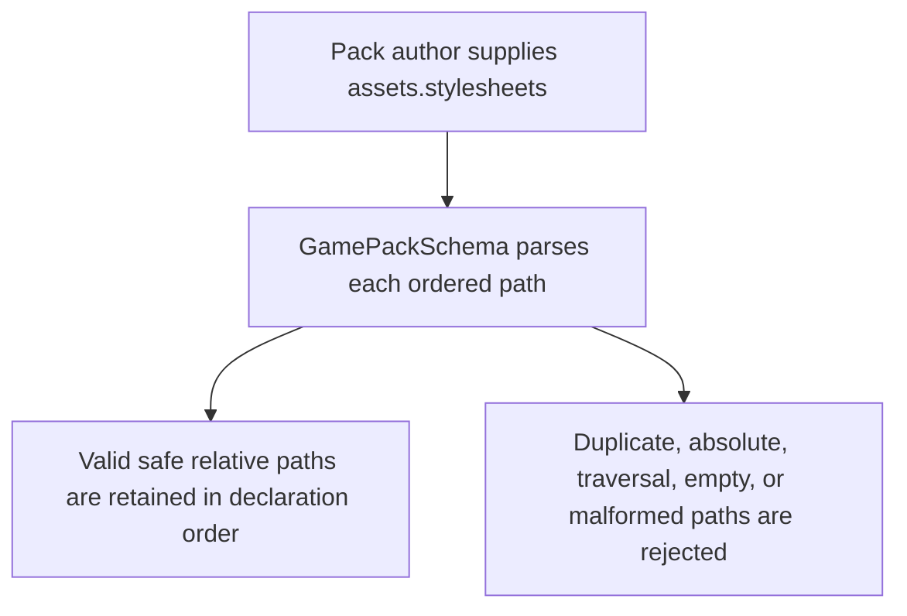
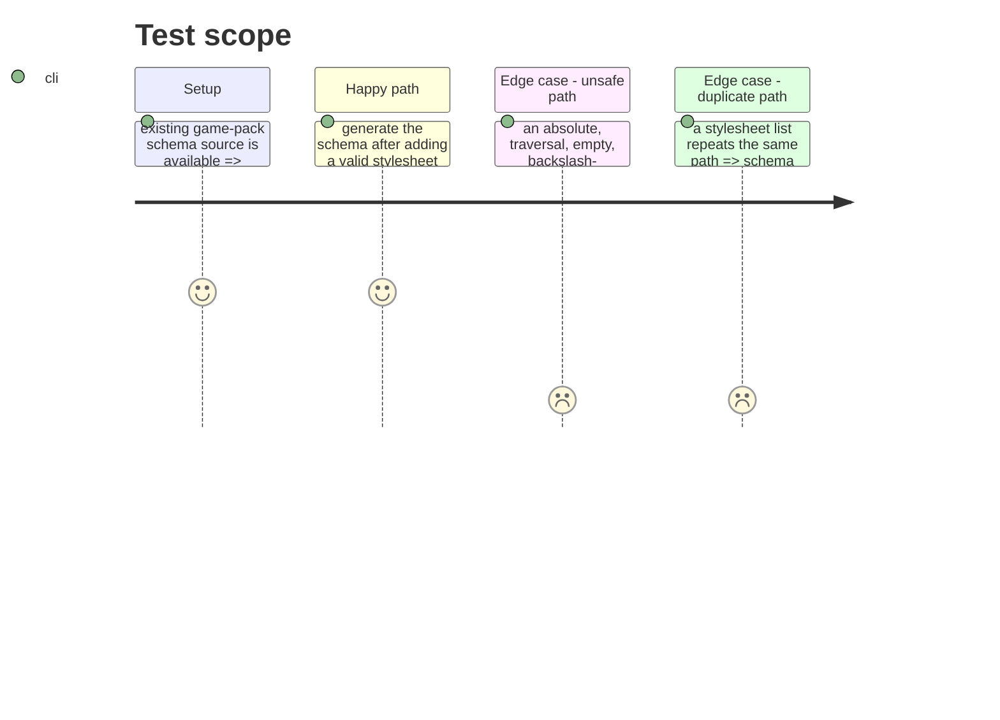

# Instruction: Define the stylesheet resource contract

## Architecture projection

> Tree of the final files. ✅ create · ✏️ modify · ❌ delete

```txt
.
├── src/zod/appearance/game-pack.ts ✏️ add the reusable safe relative asset-path schema and optional ordered assets.stylesheets declaration
└── schemas/appearance/game-pack.schema.json ✏️ regenerate Draft 7 output from the canonical Zod source
```

## User Journey



## Test Scope



## Tasks to do

### `1)` Define a safe pack-relative stylesheet path

> Express the issue's safety boundary once in the canonical Zod module.

1. Add a documented schema for non-empty stylesheet paths relative to `assets.root` (or the pack asset root when `root` is absent).
2. Permit normalized forward-slash file paths while rejecting absolute paths, parent-directory traversal, empty segments, backslashes, and URL-like or drive-qualified paths.
3. Export the inferred path type only if it improves the public schema API consistently with the existing exported types.

### `2)` Add the ordered stylesheet declaration

> Extend `AssetsSchema` without changing the validity of packs that omit it.

1. Add optional `stylesheets` as an array of the safe path schema.
2. Preserve author order, enforce duplicate rejection at Zod runtime with an array-level uniqueness refinement, and emit `uniqueItems` in the generated JSON Schema.
3. Describe the asset-root relationship and give a representative CSS-path example through schema metadata.

### `3)` Regenerate the published JSON Schema

> Keep the committed Draft 7 artifact synchronized with the canonical source.

1. Run the repository generation script.
2. Review the generated `assets.stylesheets` shape for optionality, item constraints, and uniqueness.

## Test acceptance criteria

| Task | Acceptance criteria              |
| ---- | -------------------------------- |
| 1 | A stylesheet path is accepted only when it is a normalized, non-empty relative pack asset path; absolute, traversal, separator-escape, drive-qualified, and URL-like values fail validation. |
| 2 | `assets.stylesheets` is optional, retains valid declaration order, and rejects duplicates during direct Zod parsing and Draft 7 schema validation. |
| 3 | The committed Draft 7 schema is generated from the changed Zod contract and exposes the same stylesheet constraints. |
