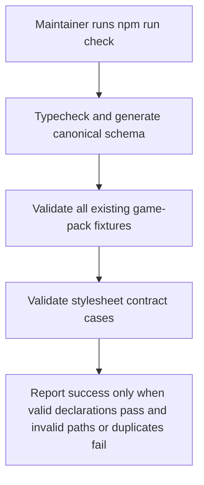
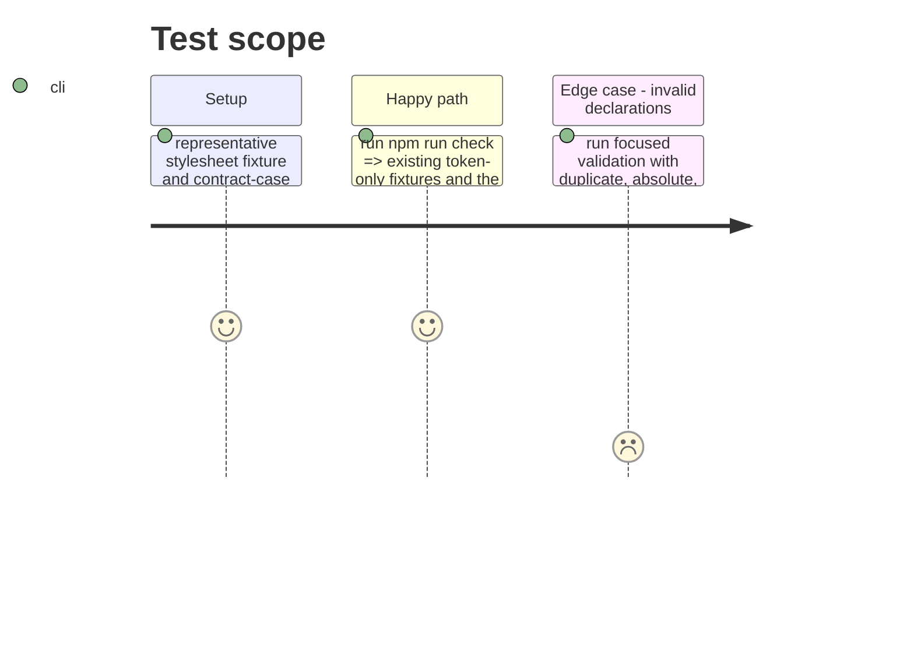

# Instruction: Prove compatibility and rejection behavior

## Architecture projection

> Tree of the final files. ✅ create · ✏️ modify · ❌ delete

```txt
.
├── tools/validate-examples.ts ✏️ extend schema validation with explicit valid and invalid stylesheet declaration cases
└── examples/appearance/game-pack/city-of-mist-shapes.json ✏️ add a representative stylesheet declaration to an existing asset-root example
```

## User Journey



## Test Scope



## Tasks to do

### `1)` Add a representative stylesheet fixture

> Demonstrate the declaration beside a pre-existing pack asset root.

1. Add an ordered CSS resource list to the City of Mist shapes fixture, which already declares `assets.root`.
2. Keep all existing token-only fixtures unchanged as backward-compatibility examples.

### `2)` Cover the contract's positive and negative cases

> Make schema-level safety and uniqueness behavior executable rather than inferred from generated output.

1. Extend the validation tooling with focused cases that exercise both direct canonical Zod parsing and generated Draft 7 schema validation.
2. Assert a valid ordered stylesheet list passes.
3. Assert duplicates, absolute paths, traversal, empty or malformed segments, backslash paths, drive-qualified paths, and URL-like values fail.
4. Keep the fixture validator's current all-example Ajv coverage intact, so the existing `npm run check` workflow continues to run the focused cases without a package-script change.

### `3)` Run the complete repository gate

> Confirm type safety, generated artifact freshness, valid fixtures, and rejection coverage together.

1. Run `npm run check`.
2. Resolve only failures caused by the stylesheet contract change.

## Test acceptance criteria

| Task | Acceptance criteria              |
| ---- | -------------------------------- |
| 1 | A committed example demonstrates ordered `assets.stylesheets` under a declared asset root, while the untouched token-only examples still validate. |
| 2 | Automated validation accepts a safe ordered list and rejects duplicate, absolute, traversal, empty, malformed, backslash, drive-qualified, and URL-like paths. |
| 3 | `npm run check` succeeds after the generated schema and all fixtures are validated. |
